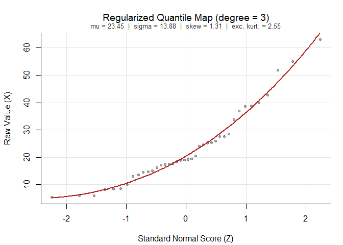
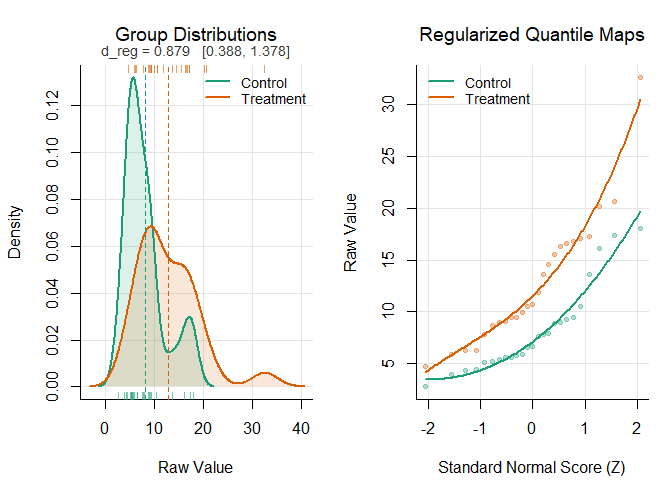

<!-- README.md is generated from README.Rmd. Please edit that file -->

# hermiteStats: Distribution-Robust Statistics via Hermite Polynomial Quantile Modeling

<!-- badges: start -->

[](https://lifecycle.r-lib.org/articles/stages.html)
[](https://opensource.org/licenses/MIT)
[](https://github.com/WLenhard/hermiteStats/actions/workflows/R-CMD-check.yaml)
<!-- badges: end -->

**`hermiteStats`** provides distribution-robust, regularized estimators
for distributional moments (mean, variance, skewness and kurtosis) and
based on this, for fundamental statistics in quantitative research:

1.  **The Hermite Correlation (r_Hermite):** a distribution-robust
    estimator of the raw-scale Pearson correlation coefficient.
2.  **The Distribution-Free Effect Size (d_reg):** a robust standardized
    mean difference for independent and paired samples that retains the
    metric and interpretation of Cohen’s *d* / Hedges’ *g*.
3.  **Distribution-robust hypothesis tests (hermite_test):** permutation
    tests for differences in mean (`t_hermite`), median
    (`median_hermite`), and distributional shape — scale/variance,
    asymmetry, and tail weight (`shape_hermite`) — unified in
    `hermite_test()`, including a joint five-dimensional distributional
    profile test with Westfall–Young family-wise error control.

The methods address a dilemma in robust statistics: classical solutions
for non-normal data — trimming, Winsorizing, or converting to ranks —
typically restore stability only by silently changing the quantity being
estimated, discarding genuine tail variance in the process.
`hermiteStats` instead models the empirical quantile function via
regularized monotone polynomial smoothing and derives exact
distributional moments in closed algebraic form using Probabilists’
Hermite polynomials. It recovers the original, interpretable estimands
of distributional moments, while gaining the stability of a robust
method.

------------------------------------------------------------------------

## Table of Contents

- [Key Features](#key-features)
- [Mathematical Foundations](#mathematical-foundations)
  - [1. Rank-Based Inverse-Normal Quantile
    Modeling](#1-rank-based-inverse-normal-quantile-modeling)
  - [2. The Orthogonal Hermite Basis and Univariate
    Moments](#2-the-orthogonal-hermite-basis-and-univariate-moments)
  - [3. Mehler’s Bilinear Expansion for
    Covariance](#3-mehlers-bilinear-expansion-for-covariance)
  - [4. Disentangling Construct Association from Scale Attenuation
    (A)](#4-disentangling-construct-association-from-scale-attenuation-a)
  - [5. Distribution-Free Effect Size
    (d_reg)](#5-distribution-free-effect-size-d_reg)
  - [Hypothesis testing on the regularized quantile
    model](#6-hypothesis-testing-on-the-regularized-quantile-model)
- [Installation](#installation)
- [Quick Start and Examples](#quick-start-and-examples)
  - [Estimating Distributional
    Moments](#estimating-distributional-moments)
  - [Hermite-Mehler Correlation
    (r_Hermite)](#hermite-mehler-correlation-r_Hermite)
  - [Correlation Matrices and Multivariate
    Analysis](#correlation-matrices-and-multivariate-analysis)
  - [Distribution-Free Effect Sizes
    (d_reg)](#distribution-free-effect-sizes-d_reg)
  - [Paired and Repeated-Measures
    Designs](#paired-and-repeated-measures-designs)
  - [Hypothesis testing for mean and shape
    differences](#hypothesis-testing)
  - [Diagnostic Visualizations](#diagnostic-visualizations)
- [Citation](#citation)
- [References](#references)

------------------------------------------------------------------------

## Key Features

- **No Estimand Shift:** Retains the raw-scale Pearson correlation and
  standardized mean difference as the target parameters — unlike rank
  correlations or Winsorized effect sizes, which silently estimate a
  different population quantity.
- **Variance Reduction in Small Samples (n \< 50):** Regularized,
  low-degree polynomial quantile smoothing prevents extreme tail
  observations from destabilizing sample covariances and pooled standard
  deviations.
- **Negligible Efficiency Loss under Normality:** Closely tracks the
  classical Pearson’s *r* / Cohen’s *d* when parametric assumptions
  hold, so there is essentially nothing to lose by using the regularized
  estimator as a default choice.
- **Flexible Monotonicity Enforcement:** Supports both a relaxed,
  rank-concordance-based check and a strict, analytically verified
  monotonicity constraint (root-finding on the fitted derivative).
- **Fully Closed-Form Computation:** All moments and covariances are
  obtained algebraically via Hermite/Mehler identities — no numerical
  integration, simulation, or iterative optimization is required.

------------------------------------------------------------------------

## Mathematical Foundations

### 1. Rank-Based Inverse-Normal Quantile Modeling

Let $X$ and $Y$ be continuous random variables with unknown cumulative
distribution functions $F_X$ and $F_Y$. The observed data are mapped to
latent standard normal scores $Z \sim \mathcal{N}(0, 1)$ using a
rank-based inverse-normal transformation (Normal Quantile
Transformation; e.g. Hazen, 1914):

$$Z_{x, i} = \Phi^{-1}\left(\frac{\text{rank}(X_i) - 0.5}{n}\right), \quad Z_{y, i} = \Phi^{-1}\left(\frac{\text{rank}(Y_i) - 0.5}{n}\right)$$

Unlike a plain rank transform, this step is only a means to an end: the
inverse quantile functions $X = f(Z_x)$ and $Y = g(Z_y)$ are then
modeled by regressing the raw values on powers of $Z$,

$$X = \sum_{j=0}^{k_x} \beta_{x, j} Z_x^j, \quad Y = \sum_{j=0}^{k_y} \beta_{y, j} Z_y^j,$$

so that the original metric and tail shape of the data are preserved
rather than discarded. To guarantee a valid quantile map, monotonicity
of $f$ (and $g$) is enforced over the observed range of $Z$,
automatically stepping down the polynomial degree whenever a violation
is detected.

### 2. The Orthogonal Hermite Basis and Univariate Moments

Standard powers $Z^j$ are not orthogonal under the Gaussian measure,
which makes their coefficients awkward for moment extraction.
Re-expressing the polynomial in the basis of **monic Probabilists’
Hermite polynomials** $He_m(z)$ (Hermite, 1866),

$$He_0(z) = 1, \quad He_1(z) = z, \quad He_2(z) = z^2 - 1, \quad He_3(z) = z^3 - 3z, \quad \dots$$

solves this: because $He_m(z)$ is orthogonal with respect to the
standard normal density,
$\mathbb{E}[He_m(Z) He_n(Z)] = m! \, \delta_{mn}$, the monomial
coefficients $\boldsymbol{\beta}$ map to Hermite coefficients
$\mathbf{a}$ via a fixed linear operator,
$\mathbf{a} = \mathbf{H}\boldsymbol{\beta}$, with

$$H_{m+1, n+1} = \binom{n}{2k} (2k - 1)!! \quad \text{for } 2k = n - m \ge 0 \text{ (and } 0 \text{ otherwise)}.$$

The mean and variance then follow immediately from the Hermite
coefficients:

$$\mathbb{E}[X] = a_0, \qquad \text{Var}(X) = \sum_{m=1}^{k_x} a_m^2 \, m!$$

Skewness $\gamma_1$ and excess kurtosis $\gamma_2$ follow analogously
from the third and fourth central moments of the fitted polynomial,
evaluated using the raw Gaussian moments $\mathbb{E}[Z^j]$ — a direct
consequence of Isserlis’ (1918) theorem for products of jointly normal
variables:

$$\gamma_1 = \frac{\mathbb{E}[(X-\hat{\mu})^3]}{\hat{\sigma}^3}, \qquad \gamma_2 = \frac{\mathbb{E}[(X-\hat{\mu})^4]}{\hat{\sigma}^4} - 3$$

All four moments are obtained this way in exact closed algebraic form,
with no numerical integration at any step.

### 3. Covariance Estimation on the Basis of Probabilists’ Hermite Polynomials

Two different variants for calculating covariance and thus the resulting
$r_{\text{Hermite}}$ are available:

#### Variant A: Copula-Free Empirical Cross-Moments (`copula = "none"`, Default)

The first variant is based directly on the fitted raw scores
($\hat{x}_i, \hat{y}_i$) and the regularized Hermite population moments.
It is completely free of prior assumptions regarding the joint
dependence structure (copula) and marginal shape. It yields lower MSE
and higher precision across a vast range of distributional scenarios
(especially in sample sizes of $n < 100$):

$$\widehat{\text{Cov}}(X, Y) = \frac{1}{n} \sum_{i=1}^n \left(\hat{x}_i - \hat{\mu}_x\right)\left(\hat{y}_i - \hat{\mu}_y\right)$$

where

$$\hat{x}_i = f(Z_{x, i}) = \sum_{j=0}^{k_x} \beta_{x, j} Z_{x, i}^j$$

is the fitted value for observation $i$ from the monotone quantile model
(see step 1), and $\hat{\mu}_x = a_0$ is the regularized population mean
derived from the Hermite polynomial representation.

Standardizing by the regularized marginal standard deviations
($\hat{\sigma}_x, \hat{\sigma}_y$) yields the **Copula-Free Hermite
Correlation**:

$$r_{\text{Hermite}} = \frac{\widehat{\text{Cov}}(X, Y)}{\hat{\sigma}_x \, \hat{\sigma}_y} = \frac{\frac{1}{n} \sum_{i=1}^n \left(\hat{x}_i - \hat{\mu}_x\right)\left(\hat{y}_i - \hat{\mu}_y\right)}{\sqrt{\left(\sum_{m=1}^{k_x} a_m^2 \, m!\right)\left(\sum_{m=1}^{k_y} b_m^2 \, m!\right)}}$$

------------------------------------------------------------------------

#### Variant B: Parametric Gaussian Copula via Mehler’s Identity (`copula = "gaussian"`)

The second variant evaluates the cross-moment expectations analytically
under the assumption that the latent normal scores $(Z_x, Z_y)$ follow a
bivariate normal distribution with correlation
$\rho_z = \text{cor}(Z_x, Z_y)$. By **Mehler’s (1866) bilinear
expansion**, all cross-orders of different degrees vanish
($\mathbb{E}[He_m(Z_x) He_n(Z_y)] = \delta_{mn} m! \rho_z^m$), yielding
the closed-form covariance:

$$\widehat{\text{Cov}}_{\text{Gauss}}(X, Y) = \sum_{m=1}^{\min(k_x, k_y)} a_m b_m \, m! \, \rho_z^m$$

and the corresponding **Gaussian-Copula Hermite Correlation**:

$$r_{\text{Hermite, Gauss}} = \frac{\sum_{m=1}^{\min(k_x, k_y)} a_m b_m \, m! \, \rho_z^m}{\sqrt{\left(\sum_{m=1}^{k_x} a_m^2 \, m!\right)\left(\sum_{m=1}^{k_y} b_m^2 \, m!\right)}}$$

This variant also yields the **Shape Attenuation Factor**
$A = r_{\text{Hermite}} / \rho_z$, which quantifies the mathematical
ceiling imposed purely by marginal shape incompatibility
(Hoeffding–Fréchet bounds).

### 4. Disentangling Construct Association from Scale Attenuation (A)

This framework cleanly separates two conceptually distinct quantities:
the pure latent dependency $\rho_z$ (the Gaussian copula parameter,
unaffected by either variable’s shape), and the manifest linear
correlation $r_{\text{Hermite}}$ (which *is* affected by shape, exactly
as classical Pearson’s $r$ would be). Their ratio defines the **Shape
Attenuation Factor (A)**:

$$A = \frac{r_{\text{Hermite}}}{\rho_z}$$

- If $A \approx 1.0$, the marginal distributions do not meaningfully
  constrain the correlation.
- If $A \ll 1.0$, part of what looks like a “weak” Pearson correlation
  is in fact a mathematical ceiling imposed by mismatched marginal
  shapes (Hoeffding-Fréchet bounds; Carroll, 1961) rather than weak
  underlying dependence.

### 5. Distribution-Free Effect Size (d_reg)

For two independent groups, marginal quantile polynomials
$X_1 = f_1(Z_1)$ and $X_2 = f_2(Z_2)$ are fitted separately to obtain
regularized population moments
$\hat{\mu}_1, \hat{\mu}_2, \hat{\sigma}_1^2, \hat{\sigma}_2^2$. The
standardized mean difference is then

$$d_{\text{reg}} = \frac{\hat{\mu}_2 - \hat{\mu}_1}{\hat{\sigma}_{\text{avg}}}, \qquad \hat{\sigma}_{\text{avg}} = \sqrt{\frac{\hat{\sigma}_1^2 + \hat{\sigma}_2^2}{2}}$$

For **paired / repeated-measures designs** (`paired = TRUE`), the
observed difference scores $D = X_2 - X_1$ are modeled directly with
their own regularized quantile fit, giving the standardized mean change
$d_z = \hat{\mu}_D / \hat{\sigma}_D$. This $\hat{\sigma}_D$ is
theoretically linked to the marginal moments and the paired
Hermite-Mehler correlation via the general variance-of-a-difference
identity

$$\hat{\sigma}_D = \sqrt{\hat{\sigma}_1^2 + \hat{\sigma}_2^2 - 2\, r_{\text{Hermite}} \, \hat{\sigma}_1 \hat{\sigma}_2}$$

(no equal-variance assumption required), which makes explicit why a
stronger paired correlation mechanically shrinks the variance of the
change scores, and hence inflates $d_z$ relative to $d_{\text{reg}}$.

### 6. Hypothesis Testing on the Regularized Quantile Model

Because every distributional aspect is a smooth functional of the fitted
quantile polynomial — mean $\mu = a_0$, median
$\text{Med} = f(0) = \beta_0$, scale $\log\sigma$ with
$\sigma^2 = \sum_m a_m^2 m!$, and the Parseval-standardized shape
weights

$$c_m = \frac{a_m\sqrt{m!}}{\sigma}, \qquad \sum_{m\ge1} c_m^2 = 1,$$

two-sample hypothesis tests reduce to contrasts on these functionals.
The indices $c_2$ (asymmetry) and $c_3$ (tail weight) are bounded in
$[-1, 1]$ and location-scale invariant, which makes their permutation
distributions far better behaved than those of classical moment ratios
$g_1, g_2$. Since the finite-sample distribution of these regularized
functionals has no closed form, inference is by **permutation**
(default), refitting the full pipeline on every resample; family-wise
error across multiple contrasts is controlled by **Westfall–Young
step-down** adjustment on the joint permutation distribution.

------------------------------------------------------------------------

## Installation

`hermiteStats` is not yet on CRAN. Install the development version
directly from GitHub:

``` r
# install.packages("remotes")
remotes::install_github("WLenhard/hermiteStats")
```

The package depends only on base R and requires R \>= 3.5.0 — there are
no dependencies to resolve.

## Quick Start and Examples

``` r
library(hermiteStats)
```

### Estimating Distributional Moments

At the core of the package is `hermite_fit()`, which maps a numeric
vector onto standard normal scores, fits a regularized monotone
polynomial quantile function, and extracts the population mean,
variance, skewness, and excess kurtosis in exact closed algebraic form,
without the instability of raw sample variance, skewness and kurtosis
estimators in small or heavy-tailed samples.

``` r
set.seed(42)
x <- rlnorm(40, meanlog = 3, sdlog = 0.5)  # right-skewed, heavy-tailed data

fit <- hermite_fit(x)
print(fit)
#> 
#>   Regularized Quantile Model (Hermite Basis)
#> ---------------------------------------------
#>   Modeled Mean (mu)      :  23.449
#>   Modeled SD (sigma)     :  13.875
#>   Modeled Variance       :  192.527
#>   Modeled Skewness (g1)  :  1.314
#>   Excess Kurtosis (g2)   :  2.552
#>   Fitted Polynomial Deg  :  3 (requested: 3)
#>   Sample Size (n)        :  40 (unique: 40, ties: 0.0%)
#>   Monotonicity Check     :  relaxed
```

`hermite_moments()` returns the same regularized moments as a plain
list, convenient for programmatic use:

``` r
hermite_moments(fit)
#> $mean
#> [1] 23.44885
#> 
#> $variance
#> [1] 192.527
#> 
#> $sd
#> [1] 13.87541
#> 
#> $skewness
#> [1] 1.314325
#> 
#> $excess_kurtosis
#> [1] 2.551613
#> 
#> $kurtosis
#> [1] 5.551613
```

`summary()` additionally shows the fitted monomial coefficients and the
orthogonal Hermite weights the moments above were derived from:

``` r
summary(fit)
#> 
#>   Regularized Quantile Model (Hermite Basis)
#> ---------------------------------------------
#>   Modeled Mean (mu)      :  23.449
#>   Modeled SD (sigma)     :  13.875
#>   Modeled Variance       :  192.527
#>   Modeled Skewness (g1)  :  1.314
#>   Excess Kurtosis (g2)   :  2.552
#>   Fitted Polynomial Deg  :  3 (requested: 3)
#>   Sample Size (n)        :  40 (unique: 40, ties: 0.0%)
#>   Monotonicity Check     :  relaxed
#> 
#>   Polynomial Coefficients (Monomial raw beta):
#>    z^0    z^1    z^2    z^3 
#> 20.481 12.831  2.968  0.130 
#> 
#>   Orthogonal Hermite Weights (a_m):
#>   He_0   He_1   He_2   He_3 
#> 23.449 13.222  2.968  0.130
```

For comparison, the raw sample mean and standard deviation on the same
data:

``` r
mean(x)
#> [1] 23.35619
sd(x)
#> [1] 13.7519
```

In a clean, moderately sized continuous sample like this one, the
regularized and raw estimates are expected to agree closely —
`hermite_fit()`’s advantage shows up primarily in small samples, tied or
contaminated data, and whenever skewness/kurtosis are of direct
interest, as the remaining examples below illustrate.

### Hermite Correlation (r_Hermite)

`cor_hermite()` estimates the raw-scale Pearson correlation between two
variables that may have very different marginal shapes — here, a roughly
normal construct and a skewed, lognormal latency, both driven by a
shared latent factor:

``` r
set.seed(42)
n <- 60
z_shared <- rnorm(n)

x <- 100 + 15 * z_shared + rnorm(n, sd = 5)      # approximately normal
y <- exp(0.4 * z_shared + rnorm(n, sd = 0.5))    # right-skewed (lognormal)

fit_cor <- cor_hermite(x, y, conf_level = 0.95, ci_method = "fisher")
print(fit_cor)
#> 
#>   Distribution-Robust Hermite Correlation
#> ----------------------------------------------------
#>   Hermite Correlation (r)    :  0.550
#>   Copula Model               :  Copula-Free (empirical cross-moments)
#>   Polynomial Degrees Fitted  :  X = 3, Y = 3
#>   Monotonicity Check         :  relaxed
#>   95% CI (fisher): [0.345, 0.706]
```

The Hermite correlation makes no assumption on the distributional shape
and the copula (the type of bivariate dependence structure). If the
copula is Gaussian - a decision to be made on the basis of theoretical
considerations - this can be specified via `copula = "gauss"`, leading
to a further decrease of MSE. In that case, further parameters are
available: `rho_z` is the latent Gaussian copula correlation;
`r_Hermite` is the corresponding raw-scale Pearson correlation implied
by the fitted marginal shapes; and `A = r_Hermite / rho_z` quantifies
how much of that latent association survives on the manifest scale (see
[Mathematical Foundations
§4](#4-disentangling-construct-association-from-scale-attenuation-a)).
`summary(fit_cor)` additionally reports the implied means, standard
deviations, and covariance on the raw scale.

### Correlation Matrices and Multivariate Analysis

For more than two variables, `cor_hermite()` dispatches to a
matrix/data-frame method, returning all three quantities as full
pairwise matrices — useful as a drop-in, shape-robust alternative to
`cor()` ahead of factor analysis, SEM, or meta-analytic synthesis:

``` r
R_hermite <- cor_hermite(iris[, 1:4])
print(R_hermite)
#> 
#>   Hermite Correlation Matrix (r_Hermite; Copula-Free):
#> ----------------------------------------------------
#>              Sepal.Length Sepal.Width Petal.Length Petal.Width
#> Sepal.Length        1.000      -0.105        0.863       0.813
#> Sepal.Width        -0.105       1.000       -0.302      -0.288
#> Petal.Length        0.863      -0.302        1.000       0.934
#> Petal.Width         0.813      -0.288        0.934       1.000
#> 
#>   Hermite Covariance Matrix (diagonal: variances):
#>              Sepal.Length Sepal.Width Petal.Length Petal.Width
#> Sepal.Length        0.683      -0.038        1.210       0.502
#> Sepal.Width        -0.038       0.193       -0.225      -0.095
#> Petal.Length        1.210      -0.225        2.883       1.186
#> Petal.Width         0.502      -0.095        1.186       0.559
#> 
#>   Regularized Marginal Moments:
#>      Variable  Mean Variance    SD Skewness Degree
#>  Sepal.Length 5.844    0.683 0.826    0.318      3
#>   Sepal.Width 3.058    0.193 0.439    0.335      3
#>  Petal.Length 3.757    2.883 1.698   -0.069      3
#>   Petal.Width 1.201    0.559 0.748    0.008      3
```

### Partial and semipartial correlation

To evaluate the association between two variables while controlling for
one or more confounding covariates $\mathbf{Z}$, `pcor_hermite()`
computes the conditional covariance matrix (or inverted precision
matrix) directly from the regularized Hermite moments. This yields
distribution-robust partial ($r_{XY \cdot \mathbf{Z}}$) and semipartial
($r_{X(Y \cdot \mathbf{Z})}$) correlations. It supports single or
multiple continuous covariates as well as full partial correlation
matrices for multivariate data:

``` r
# Simulate X, Y, and a confounder Z with skewed distributions
set.seed(42)
z <- rlnorm(60, meanlog = 1, sdlog = 0.5)
x <- 0.6 * z + rnorm(60, sd = 2)
y <- 0.7 * z + rnorm(60, sd = 2)

# Raw correlation (confounded by Z)
cor_hermite(x, y)
#> 
#>   Distribution-Robust Hermite Correlation
#> ----------------------------------------------------
#>   Hermite Correlation (r)    :  0.148
#>   Copula Model               :  Copula-Free (empirical cross-moments)
#>   Polynomial Degrees Fitted  :  X = 3, Y = 3
#>   Monotonicity Check         :  relaxed

# Partial correlation controlling for Z (Copula-Free)
# If you expect a Gaussian copula, add 'copula = "gaussian"'
pcor_hermite(x, y, z = z, conf_level = 0.95)
#> 
#>   Distribution-Robust Partial Correlation (r_Hermite)
#> ------------------------------------------------------
#>   Estimate                   :  -0.056
#>   Copula Mode                :  Copula-Free
#>   Controlled Covariates (k)  :  1
#>   Sample Size (n)            :  60
#>   95% CI (fisher): [-0.307, 0.203]

# Semipartial correlation controlling for Z in Y only
pcor_hermite(x, y, z = z, semi = TRUE, conf_level = 0.95)
#> 
#>   Distribution-Robust Semipartial (Part) Correlation (r_Hermite)
#> ------------------------------------------------------
#>   Estimate                   :  -0.051
#>   Copula Mode                :  Copula-Free
#>   Controlled Covariates (k)  :  1
#>   Sample Size (n)            :  60
#>   95% CI (fisher): [-0.303, 0.208]

# Full Partial Correlation Matrix for iris dataset (every entry is the
# partial correlation after removing the influence of all remaining variables)
pcor_hermite(iris[, 1:4])
#> 
#>   Hermite Partial Correlation Matrix (Copula-Free):
#> --------------------------------------------------------
#>              Sepal.Length Sepal.Width Petal.Length Petal.Width
#> Sepal.Length        1.000       0.323        0.537       0.047
#> Sepal.Width         0.323       1.000       -0.250      -0.032
#> Petal.Length        0.537      -0.250        1.000       0.757
#> Petal.Width         0.047      -0.032        0.757       1.000
```

### Distribution-Free Effect Sizes (d_reg)

`d_reg()` estimates a standardized mean difference that keeps Cohen’s
*d* metric and interpretation, but is far less sensitive to skewness and
small-sample instability. It accepts either two vectors or, as here, a
formula interface:

``` r
set.seed(123)
df_study <- data.frame(
  score = c(rlnorm(25, meanlog = 2.0, sdlog = 0.5),   # Control (skewed)
            rlnorm(25, meanlog = 2.4, sdlog = 0.5)),  # Treatment
  group = factor(rep(c("Control", "Treatment"), each = 25))
)

fit_d <- d_reg(score ~ group, data = df_study, conf_level = 0.95, ci_method = "bootstrap")
print(fit_d)
#> 
#>   Distribution-Free Effect Size Estimation (d_reg)
#> ----------------------------------------------------
#>   Effect Size (d_reg)               :  0.879
#>   Standardizer Used (denominator)   :  5.382
#>   Hedges' g (Benchmark)             :  0.884
#>   Sample Sizes                      :  n1 = 25, n2 = 25
#>   Polynomial Degrees                :  g1 = 3, g2 = 3
#>   Monotonicity Check                :  relaxed
#>   95% CI (bootstrap): [0.388, 1.378]
```

You can as well directly compare two variables with `d_reg(x, y)`.
Alongside `d_reg`, the object also carries the classical Hedges’ *g*
benchmark and, on request, a percentile bootstrap confidence interval;
`summary(fit_d)` reports the regularized moments underlying both groups.

### Paired and Repeated-Measures Designs

For within-subject designs, `paired = TRUE` fits the marginal
distributions *and* the observed difference-score distribution,
reporting both the raw-scale effect size and the standardized mean
change:

``` r
set.seed(7)
pre  <- rlnorm(30, meanlog = 3.0, sdlog = 0.4)
post <- pre + rnorm(30, mean = 5.0, sd = 2.0)

fit_paired <- d_reg(pre, post, paired = TRUE, conf_level = 0.95)
print(fit_paired)
#> 
#>   Distribution-Free Effect Size Estimation (d_reg)
#> ----------------------------------------------------
#>   Effect Size (d_reg, raw scale)    :  0.406
#>   Standardized Mean Change (d_z)    :  3.188
#>   Paired Hermite Correlation (r)    :  0.928 [Copula-Free]
#>   Averaged Model SD (sigma_avg)     :  12.505
#>   Difference Model SD (sigma_diff)  :  1.592
#>   Standardizer Used (denominator)   :  12.505
#>   Hedges' g (Benchmark)             :  0.399
#>   Sample Sizes                      :  n1 = 30, n2 = 30
#>   Polynomial Degrees                :  g1 = 3, g2 = 3
#>   Monotonicity Check                :  relaxed
#>   95% CI (bootstrap): [2.535, 4.261]
```

`d_reg` (raw scale) is directly comparable to independent-groups effect
sizes, e.g. in a meta-analysis mixing designs; `d_z` is standardized by
the variability of the change scores themselves and will be larger
whenever the paired Hermite correlation is strong (see [Mathematical
Foundations §5](#5-distribution-free-effect-size-d_reg)).

### Hypothesis Testing

`hermiteStats` provides a full suite of distribution-robust two-sample
and paired hypothesis tests, all built on the same regularized quantile
engine and all defaulting to permutation inference (the entire
estimation pipeline is refitted on every resample, so the null
distribution reflects the same estimation variability as the observed
statistic):

| Function | Tests | Notes |
|----|----|----|
| `t_hermite()` | Mean difference | Regularized analogue of Welch’s *t* |
| `median_hermite()` | Median difference | On-metric median test; higher power than Welch on skewed data, calibrated where raw-median permutation fails |
| `shape_hermite()` | Scale, asymmetry (c₂), tail weight (c₃) | Westfall–Young adjusted; far more powerful than KS for shape departures |
| `hermite_test()` | All of the above, jointly | The unified entry point (recommended) |

The most convenient entry point is `hermite_test()`. With
`test = "complete"` (the default), it evaluates all five contrasts —
mean, median, scale, asymmetry, tail weight — against a single joint
permutation null, adjusts the p-values across the whole family
(Westfall–Young), and reports a global omnibus test of distributional
equality:

``` r
set.seed(42)
g1 <- rnorm(50, mean = 10, sd = 2)
g2 <- 10 + 2 * (rgamma(50, shape = 2) - 2) / sqrt(2)  # equal mean & SD, but skewed

res <- hermite_test(g1, g2, nperm = 1000)
print(res)
#> 
#>   Two-Sample Hermite Distributional Profile Test (joint permutation)
#> --------------------------------------------------------------------
#>   Sample Sizes        :  n1 = 50, n2 = 50
#>   Polynomial Degree   :  3
#>   Permutations        :  1000 / 1000 usable (100.0%)
#> 
#>   Regularized Group Profiles:
#>             mean median    sd     c2     c3
#>   Group 1  9.926 10.034 2.291 -0.066 -0.013
#>   Group 2 10.145  9.904 1.827  0.186 -0.213
#> 
#>   Contrasts (Group 2 - Group 1):
#>               Test Estimate Statistic p-value p (WY)
#>               Mean   +0.219     0.529   0.616  0.713
#>             Median   -0.130    -0.227   0.785  0.785
#>  Scale (log sigma)   -0.226    -1.660   0.100  0.223
#>     Asymmetry (c2)   +0.253     2.237   0.022  0.092
#>   Tail Weight (c3)   -0.199    -1.874   0.064  0.191
#> 
#>   Variance Ratio (sigma2^2 / sigma1^2) :  0.636
#>   Omnibus Test (minP)   :  Statistic = 0.022  |  p-value = 0.092
```

Here a *t*-test or *F*-test would find nothing — the groups differ in
*shape*, which the asymmetry contrast and the omnibus test detect.
Single aspects are available via the `test` argument (delegating to the
canonical functions, so their full diagnostics remain available):

``` r
# Median difference on skewed data (permutation, default)
ctrl <- rlnorm(30, meanlog = 2.0, sdlog = 0.6)
trt  <- rlnorm(30, meanlog = 2.4, sdlog = 0.6)
hermite_test(ctrl, trt, test = "median", nperm = 1000)
#> 
#>   Two-Sample Hermite Median Difference Test (permutation)
#> ------------------------------------------------------------
#>   t_Median Statistic         :  3.025
#>   Regularized Median Diff    :  3.465
#>   Standardized Effect (d)    :  0.524
#>     Group 1 Median           :  7.078 (Mean = 7.660, c2 = 0.234)
#>     Group 2 Median           :  10.543 (Mean = 12.867, c2 = 0.379)
#>   Standard Error (SE_diff)   :  1.145 (df = 51.6)
#>   Sample Sizes               :  n1 = 30, n2 = 30
#>   Alternative                :  two.sided
#>   Permutations (usable)      :  1000 / 1000 (100.0%)
#>   p-value                    :  0.016

# Variance comparison, reported as a variance ratio
hermite_test(ctrl, trt, test = "variance", nperm = 1000)
#> 
#>   Two-Sample Hermite Shape Test (location-aligned permutation)
#> ----------------------------------------------------------------
#>   Sample Sizes        :  n1 = 30, n2 = 30
#>   Polynomial Degree   :  3
#>   Permutations        :  1000 / 1000 usable (100.0%)
#> 
#>   Hermite Contrast Profile (Group 2 - Group 1):
#>           Contrast Group 1 Group 2 Difference p-value p (WY)
#>  Scale (log sigma)   1.258   2.160     +0.902   0.041  0.041
#> 
#>   Variance Ratio (sigma2^2 / sigma1^2) :  6.078
```

Paired designs are supported throughout via `paired = TRUE`
(sign-flipping / pair-swap permutation), and all tests accept the
formula interface:

``` r
df <- data.frame(score = c(g1, g2), group = factor(rep(c("A", "B"), each = 50)))
hermite_test(score ~ group, data = df, nperm = 1000)
#> 
#>   Two-Sample Hermite Distributional Profile Test (joint permutation)
#> --------------------------------------------------------------------
#>   Sample Sizes        :  n1 = 50, n2 = 50
#>   Polynomial Degree   :  3
#>   Permutations        :  1000 / 1000 usable (100.0%)
#> 
#>   Regularized Group Profiles:
#>       mean median    sd     c2     c3
#>   A  9.926 10.034 2.291 -0.066 -0.013
#>   B 10.145  9.904 1.827  0.186 -0.213
#> 
#>   Contrasts (Group 2 - Group 1):
#>               Test Estimate Statistic p-value p (WY)
#>               Mean   +0.219     0.529   0.564  0.674
#>             Median   -0.130    -0.227   0.808  0.808
#>  Scale (log sigma)   -0.226    -1.726   0.092  0.205
#>     Asymmetry (c2)   +0.253     2.235   0.019  0.078
#>   Tail Weight (c3)   -0.199    -1.863   0.058  0.180
#> 
#>   Variance Ratio (sigma2^2 / sigma1^2) :  0.636
#>   Omnibus Test (minP)   :  Statistic = 0.019  |  p-value = 0.078
```

Every test object has a `plot()` method displaying the permutation null
distribution(s) with the observed statistic marked. For exploratory work
a few hundred permutations suffice; for reported results use
`nperm >= 1000`.

### Diagnostic Visualizations

Every model object has a `plot()` method, so the regularization step is
never a black box.

A single fitted quantile model shows the empirical normal scores against
the raw data, overlaid with the fitted polynomial and its regularized
moments:

``` r
plot(fit)
```



A `cor_hermite` fit shows the latent copula on the left, and the
manifest association on the right — with both the model-implied
conditional mean curve and a purely empirical lowess smooth, so that
curvature attributable to marginal shape can be visually distinguished
from a genuine departure from the constant-correlation copula
assumption:

``` r
plot(fit_cor)
```


A `d_reg` fit shows both groups’ empirical densities (with regularized
means and the effect size annotated) alongside their regularized
quantile maps overlaid on a single panel:

``` r
plot(fit_d)
```



## Citation

If you use `hermiteStats` in published research, please cite both the
software and the manuscript describing the according estimators. The
manuscripts are currently under peer review or in preparation; please
check the package repository for updated publication details (journal,
volume, DOI) once available.

``` bibtex
@Manual{lenhard2026hermiteStatsPkg,
  title  = {{hermiteStats}: Distribution-Robust Statistics via Hermite Polynomial Quantile Modeling},
  author = {Wolfgang Lenhard and Alexandra Lenhard},
  year   = {2026},
  note   = {R package version 0.4.0},
  url    = {https://github.com/WLenhard/hermiteStats}
}

@Unpublished{lenhard2026dreg,
  title  = {Distribution-Free Effect Size Estimation: A Robust Alternative to {Cohen's d} and Other Effect Size Estimators},
  author = {Wolfgang Lenhard and Alexandra Lenhard},
  note   = {Manuscript under review}
}

@Unpublished{lenhard2026hermitetests,
  title  = {Distribution-Robust Permutation Tests for Comparing Two Distributions in Location, Scale, and Shape via Hermite Quantile modelling},
  author = {Wolfgang Lenhard and Alexandra Lenhard},
  note   = {Manuscript in preparation}
}

@Unpublished{lenhard2026hermite,
  title  = {The {Hermite} Correlation: A Distribution-Robust Estimator of the {Pearson} Correlation Coefficient},
  author = {Wolfgang Lenhard and Alexandra Lenhard},
  note   = {Manuscript in preparation}
}
```

## References

- Carroll, J. B. (1961). The nature of the data, or how to choose a
  correlation coefficient. *Psychometrika*, 26(4), 347–372.
  <https://doi.org/10.1007/BF02289768>
- Cohen, J. (1988). *Statistical Power Analysis for the Behavioral
  Sciences* (2nd ed.). Lawrence Erlbaum Associates.
- Hazen, A. (1914). Storage to be provided in impounding municipal water
  supply. *Transactions of the American Society of Civil Engineers*,
  77(1), 1539–1640.
- Hedges, L. V. (1981). Distribution theory for Glass’s estimator of
  effect size and related estimators. *Journal of Educational
  Statistics*, 6(2), 107–128.
  <https://doi.org/10.3102/10769986006002107>
- Hermite, C. (1866). Sur un nouveau développement en série des
  fonctions. *Comptes Rendus de l’Académie des Sciences, Paris*, 58,
  93–100.
- Isserlis, L. (1918). On a formula for the product-moment coefficient
  of any order of a normal frequency distribution. *Biometrika*,
  12(1/2), 134–139. <https://doi.org/10.1093/biomet/12.1-2.134>
- Mehler, F. G. (1866). Ueber die Entwicklung einer Function von
  beliebig vielen Variabeln nach Laplaceschen Functionen höherer
  Ordnung. *Journal für die reine und angewandte Mathematik*, 66,
  161–176. <https://doi.org/10.1515/crll.1866.66.161>
- Sklar, M. (1959). Fonctions de répartition à n dimensions et leurs
  marges. *Publications de l’Institut de Statistique de l’Université de
  Paris*, 8, 229–231.

------------------------------------------------------------------------
